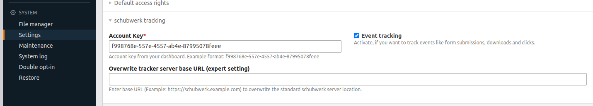

# schubwerk Tracking for Contao 4

This module adds [schubwerk](https://www.schubwerk.de/) server-side tracking and event tracking to Contao 4.

## Configuration

* Install the module (Composer package: `schubwerk/contao-schubwerk-tracking-bundle`)
* Configure your account key under `System -> Settings -> schubwerk tracking`
  

## Remarks

* The modules send a CSP header `Content-Security-Policy: frame-ancestors https://tracker.schubwerk.de`.

## Release Process

* Update the version number in `EventListener/GeneratePageListener.php`
* Tag new version
